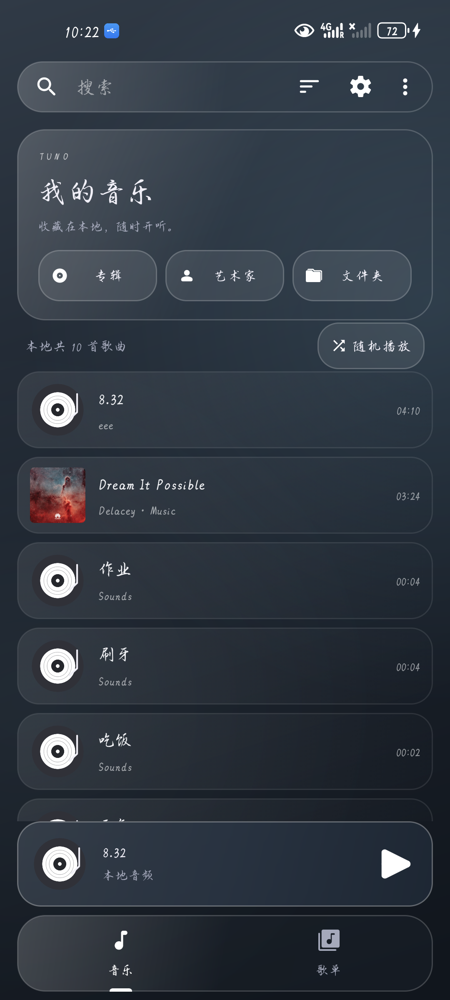
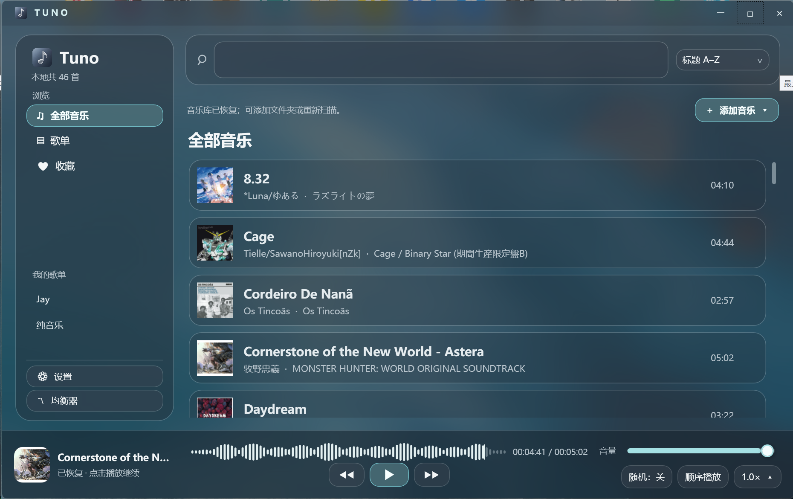
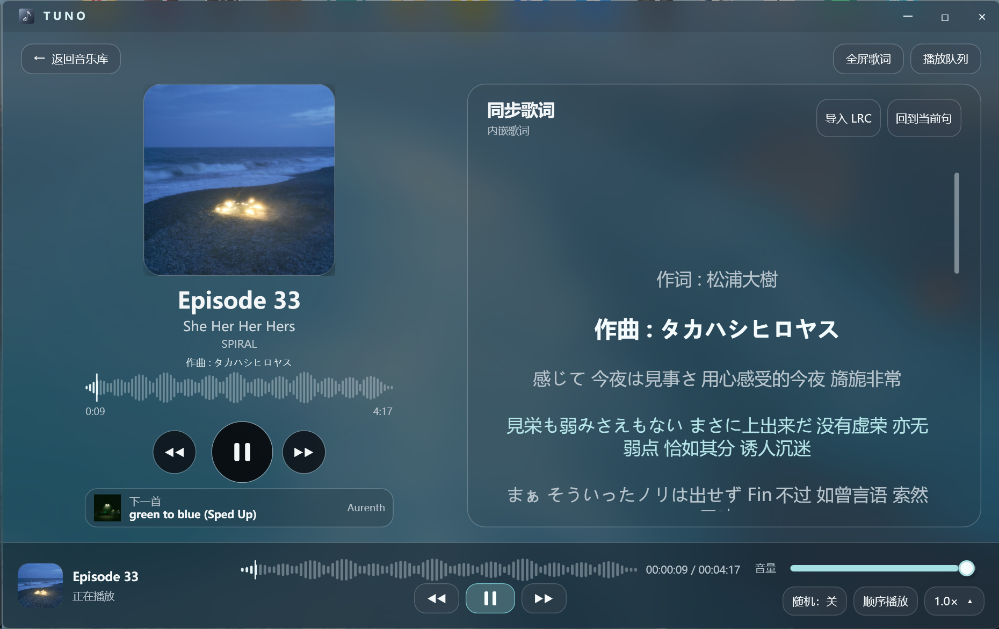

# Tuno

Tuno 是一个面向本地音乐收藏的开源播放器项目，包含 Android 客户端和 Windows 桌面端。它强调离线播放、清晰的音乐库管理、同步歌词和克制的界面，不依赖在线账号或云端音乐服务。

> 当前项目处于持续开发阶段。Android 端已有可运行构建；Windows 端为 WPF 预览版，部分功能和视觉验收仍在推进中。

## 界面预览

| Android | Windows 音乐库 | Windows 播放页与歌词 |
| --- | --- | --- |
|  |  |  |

Android 播放页、同步歌词和菜单等更多界面见源码中的页面实现；Windows 端的播放页、队列和歌词布局见 [windows/README.md](windows/README.md)。

## 当前功能

- Android 本地音乐库、搜索、专辑/艺术家/文件夹浏览和歌单。
- Android 播放控制、后台播放、桌面小组件、均衡器、睡眠计时器和多语言资源。
- LRC 歌词导入、同名歌词读取和音频内嵌歌词回退；播放页支持点击歌词跳转。
- Windows x64/WPF 本地音乐库、歌单、队列、随机与循环播放、波形进度、倍速、均衡器和歌词页面。
- Windows 支持鼠标和键盘切歌，并使用 Desktop Acrylic；不支持系统磨砂时回退为深色实底。

## 平台状态

| 平台 | 状态 | 主要目录 |
| --- | --- | --- |
| Android | 可构建的开发版，建议使用 `fossDebug` 验证 | `app/` |
| Windows 11 x64 | WPF 预览版，可从源码构建；安装包暂未签名 | `windows/` |

## Android 构建

环境要求：JDK 21、Android SDK Platform 36、Android Studio，以及可访问 Gradle、Google Maven、Maven Central 和 JitPack 的网络环境。

```powershell
$env:JAVA_HOME = '你的 JDK 21 路径'
.\gradlew.bat :app:assembleFossDebug
```

APK 输出在 `app/build/outputs/apk/foss/debug/`。正式发布版请自行配置签名，参考 [keystore.properties_sample](keystore.properties_sample)。

## Windows 构建

Windows 端的独立说明、功能清单、验证命令和安装包构建方法见 [windows/README.md](windows/README.md)。源码使用 WPF/.NET 10、LibVLCSharp、SQLite 和 TagLibSharp。

```powershell
dotnet restore windows/Tuno.PlaybackProbe --configfile windows/NuGet.Config --packages windows/.packages
dotnet build windows/Tuno.PlaybackProbe --no-restore
```

制作安装包需要 Inno Setup 7；公开发布前请注意，当前安装包尚未完成代码签名。

## 源码来源与许可证

Android 端基于 [Fossify Music Player](https://github.com/FossifyOrg/Music-Player) 1.8.1（上游提交 `b81deb8c6b953152b6964ccebb55ae3fed445415`）移植并进行 Tuno 品牌、导航、播放页和磨砂界面调整。上游说明保存在 [UPSTREAM_README.md](UPSTREAM_README.md)。

本项目保留 GPL-3.0 许可证，详见 [LICENSE](LICENSE)。提交问题或贡献代码前，请先阅读 [CONTRIBUTING.md](CONTRIBUTING.md)。

## 开发说明

构建缓存、本地路径、迁移备份、测试数据库、测试音频和 Windows 发布目录不会进入版本库。功能变化记录在 [CHANGELOG.md](CHANGELOG.md)；Android 与 Windows 的平台细节分别记录在根目录和 [windows/](windows/) 文档中。
